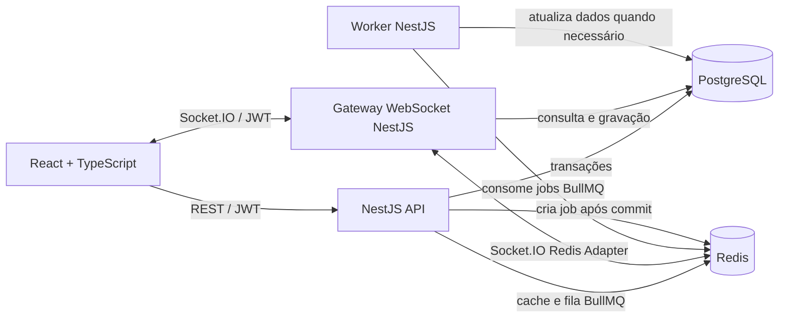

# SyncSpace

Plataforma colaborativa em tempo real para organizar projetos, quadros e documentos. O projeto demonstra sincronização por eventos, autenticação JWT, concorrência otimista e processamento assíncrono.

> **Status:** demo funcional de quadro em tempo real. A sessão JWT é de demonstração e o estado do quadro fica em memória; autenticação real e persistência PostgreSQL são próximas etapas.

## Arquitetura



O diagrama representa a arquitetura alvo. Na demo atual, a API mantém o quadro em memória; PostgreSQL já sobe pelo Compose, mas a persistência do domínio ainda não foi ligada.

### Fluxo de uma alteração colaborativa

1. O cliente envia uma mutação REST autenticada, incluindo a versão que leu do recurso.
2. A API valida JWT e autorização; em uma transação PostgreSQL, aplica a alteração somente se a versão ainda for a esperada (concorrência otimista).
3. Após o commit, a API publica um evento de domínio. A entrega pode ser feita por um padrão **transactional outbox** para não perder eventos entre o commit e a publicação.
4. O Gateway publica o evento na sala Socket.IO correspondente ao quadro/documento. O Redis Adapter propaga-o entre instâncias do Gateway; os clientes conectados recebem a atualização sem refresh.
5. Para notificações e relatórios, a API adiciona jobs BullMQ ao Redis. Um processo worker independente consome os jobs e executa o trabalho fora do ciclo da requisição.

PostgreSQL é a fonte de verdade. Redis acelera leituras descartáveis e coordena distribuição de eventos/fila; não substitui a persistência. Configure namespaces/prefixos distintos para BullMQ e Socket.IO e não dependa do cache para consistência. O cache deve ser invalidado ou atualizado após o commit.

### Responsabilidades

| Componente | Responsabilidade |
| --- | --- |
| API REST (NestJS) | Autenticação/autorização, validação, regras de negócio, transações e criação de jobs/eventos. |
| Gateway WebSocket (NestJS + Socket.IO) | Autenticar o handshake, controlar salas, validar eventos de entrada e distribuir atualizações. |
| Worker (NestJS + BullMQ) | Consumir filas, aplicar retry/backoff e processar e-mails/relatórios sem bloquear requisições. |
| PostgreSQL | Persistência, integridade referencial e controle de concorrência por versão. |
| Redis | Cache com TTL, transporte Pub/Sub do Socket.IO Adapter e armazenamento de filas BullMQ. |

O Gateway pode começar como módulo do mesmo app NestJS para compartilhar serviços de domínio; API e worker executam como processos/containers separados. Isso mantém responsabilidades claras sem duplicar regras de negócio.

### Concorrência

Cada recurso editável terá uma coluna `version` (ou `updatedAt`/ETag). Atualizações usam compare-and-swap, por exemplo `UPDATE ... WHERE id = $id AND version = $expected`, incrementando a versão na mesma transação. Se nenhuma linha for atualizada, a API retorna `409 Conflict` com a versão atual; o cliente reconcilia e reaplica a edição. Para texto colaborativo caractere a caractere, avaliar CRDT/OT como uma evolução separada.

## Autenticação WebSocket

O cliente envia o JWT no campo `auth` do handshake do Socket.IO, nunca na URL (evita exposição em logs e histórico). O servidor valida assinatura, algoritmo permitido, emissor/audiência e expiração com a mesma configuração usada pela API. Após conectar, cada evento também precisa de autorização para a sala/recurso; autenticar o socket não autoriza acesso irrestrito.

Exemplo conceitual em NestJS:

```ts
@WebSocketGateway({ namespace: '/collaboration', cors: { origin: process.env.WEB_ORIGIN } })
export class CollaborationGateway implements OnGatewayInit {
  constructor(private readonly jwt: JwtService, private readonly memberships: MembershipsService) {}

  async handleConnection(client: Socket) {
    try {
      const token = client.handshake.auth?.token;
      if (typeof token !== 'string' || token.length === 0) throw new UnauthorizedException();

      const claims = await this.jwt.verifyAsync<{ sub: string }>(token, {
        algorithms: ['HS256'],
        issuer: process.env.JWT_ISSUER,
        audience: process.env.JWT_AUDIENCE,
      });

      client.data.userId = claims.sub;
    } catch {
      client.disconnect(true);
    }
  }

  @SubscribeMessage('board:join')
  async joinBoard(@ConnectedSocket() client: Socket, @MessageBody() body: { boardId: string }) {
    const userId = client.data.userId;
    if (!userId || !(await this.memberships.canReadBoard(userId, body.boardId))) {
      throw new WsException('Acesso negado');
    }
    await client.join(`board:${body.boardId}`);
  }
}
```

O scaffold local usa `HS256` com `JWT_SECRET` de pelo menos 32 caracteres. Em produção, prefira validação assimétrica com chave pública no Gateway, mantenha a chave privada apenas no serviço emissor e configure o algoritmo explicitamente. Em qualquer ambiente, use TLS, allowlist de origens, tokens curtos e rotação/expiração; não registre tokens. Revogação de sessões e limites de conexão/eventos também devem ser aplicados.

## Executar com Docker

Requisitos: Docker Engine e Docker Compose v2. Em um host com bridge Docker funcional, copie `.env.example` para `.env` e inicie a stack:

```bash
cp .env.example .env
docker compose --profile app up --build
```

API REST: `http://localhost:3000/api`; Socket.IO: `http://localhost:3000/collaboration`. O endpoint `GET /api/health` é público. `POST /api/jobs/notifications` exige um JWT assinado com o segredo configurado. O worker apenas registra a notificação no log nesta etapa; envio de e-mail real será adicionado depois. Os valores de desenvolvimento não devem ser usados em produção; configure secrets e credenciais fortes.

### Executar neste workspace

Neste dev container, o Redis funciona pela porta publicada no host, mas a comunicação TCP entre containers na bridge está bloqueada pelo runtime. Para ver a demo aqui, deixe PostgreSQL/Redis em Docker e execute os processos Node no host. Em três terminais:

```bash
docker compose up -d postgres redis
```

```bash
cd apps/api
REDIS_HOST=127.0.0.1 REDIS_PORT=6379 REDIS_PASSWORD=syncspace_redis_dev JWT_SECRET=syncspace-local-secret-change-me-32chars JWT_ISSUER=syncspace-api JWT_AUDIENCE=syncspace-clients PORT=3000 npm run start:dev
```

```bash
cd apps/api
REDIS_HOST=127.0.0.1 REDIS_PORT=6379 REDIS_PASSWORD=syncspace_redis_dev JWT_SECRET=syncspace-local-secret-change-me-32chars JWT_ISSUER=syncspace-api JWT_AUDIENCE=syncspace-clients npm run start:worker:dev
```

```bash
cd apps/web && npm run dev
```

Abra `http://localhost:5173/`. Use o seletor de identidade no canto inferior para abrir uma segunda sessão/aba; mover um cartão em uma sessão atualiza a outra via Socket.IO. O botão de seta avança o cartão de coluna. O endpoint de sessão e os dados iniciais são exclusivamente para demo e não persistem após reiniciar a API.

## Configuração de ambiente

| Variável | Uso | Padrão local |
| --- | --- | --- |
| `POSTGRES_DB` | Banco da aplicação | `syncspace` |
| `POSTGRES_USER` | Usuário PostgreSQL | `syncspace` |
| `POSTGRES_PASSWORD` | Senha PostgreSQL | `syncspace_dev` |
| `REDIS_PASSWORD` | Senha Redis | `syncspace_redis_dev` |
| `JWT_SECRET` | Chave HMAC para tokens HS256 (mínimo 32 caracteres) | valor local no `.env.example` |
| `JWT_ISSUER` | Emissor aceito pelo validador JWT | `syncspace-api` |
| `JWT_AUDIENCE` | Audiência esperada | `syncspace-clients` |
| `WEB_ORIGIN` | Origem permitida para o frontend | `http://localhost:5173` |

## Estrutura do projeto

```text
apps/
  api/                 # NestJS: REST, auth JWT, Gateway Socket.IO, fila e worker
  web/                 # React + TypeScript
  worker/              # Próxima etapa: separar worker em app próprio
packages/
  contracts/           # DTOs e contratos de eventos compartilhados
```

API e Gateway estão no mesmo app NestJS; o worker é executado como processo independente do mesmo pacote. Ele pode ser separado em `apps/worker` quando a escala ou o ciclo de deploy justificar.

## Demonstração

### Sincronização em duas abas

<!-- TODO: gravar GIF da demo funcional em duas abas. -->


### Diagrama de sequência

<!-- TODO: adicionar diagrama de sequência API -> PostgreSQL/outbox -> Redis -> Gateway -> clientes. -->

## Testes

Builds validados: `cd apps/api && npm run build` e `cd apps/web && npm run build`. O fluxo manual validado cobre duas sessões JWT recebendo movimento por Socket.IO, versão desatualizada retornando `409` e job BullMQ consumido pelo worker. Próxima etapa: transformar esses fluxos em testes automatizados e persistir quadros no PostgreSQL.

## Commits

Usaremos commits semânticos, por exemplo `feat: sincronizar movimentação de cartões` e `fix: rejeitar handshake com token expirado`.